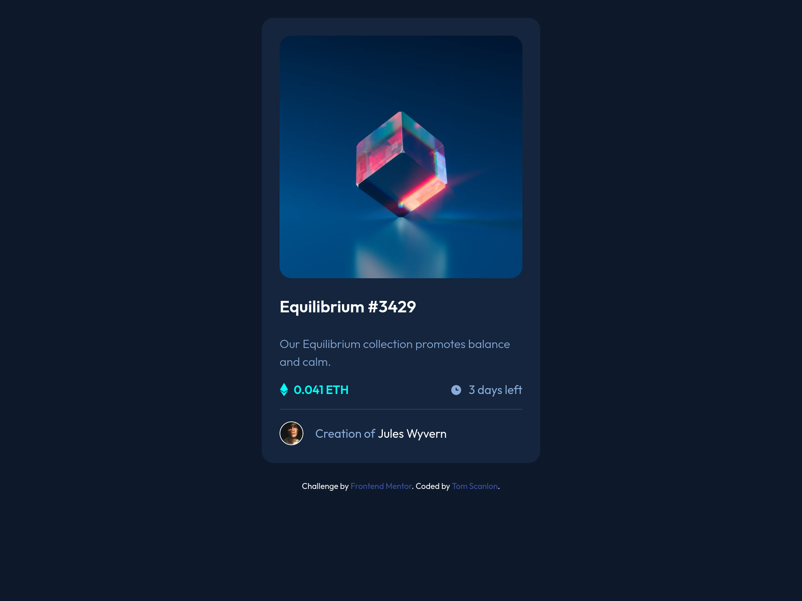

# Frontend Mentor - NFT preview card component solution

This is a solution to the [NFT preview card component challenge on Frontend Mentor](https://www.frontendmentor.io/challenges/nft-preview-card-component-SbdUL_w0U). Frontend Mentor challenges help you improve your coding skills by building realistic projects.

## Table of contents

- [Overview](#overview)
  - [The challenge](#the-challenge)
  - [Screenshot](#screenshot)
  - [Links](#links)
- [My process](#my-process)
  - [Built with](#built-with)
  - [What I learned](#what-i-learned)
  - [Continued development](#continued-development)
  - [Useful resources](#useful-resources)
- [Author](#author)
- [Acknowledgments](#acknowledgments)

**Note: Delete this note and update the table of contents based on what sections you keep.**

## Overview

### The challenge

Users should be able to:

- View the optimal layout depending on their device's screen size
- See hover states for interactive elements

### Screenshot



### Links

- Solution URL: [Github](https://github.com/tbscanlon/fm-nft-preview)

## My process

### Built with

- Semantic HTML5 markup
- CSS custom properties
- Flexbox
- Mobile-first workflow

### What I learned

I focused on building a solution to this challenge using pure HTML & CSS, without any other tools or libraries to assist me. Two main reasons why:

1. To practice some of my fundamental skills
2. To foster appreciation for modern development libraries and workflows

Recent work (at the time of writing) has given me a great appreciation for CSS custom properties. I like to use them to tokenise a style guide, because I find using a constraints-based design system much easier to build layouts with.

As an example, I mean using values from a design system like this:

```css
:root {
  /* Spacing */
  --space-xs: 8px;
  --space-s: 16px;
  --space-m: 24px;
}

div {
  padding: var(--space-s);
}
```

As opposed to this:

```css
div {
  padding: 16px;
}
```

It may seem a bit over-engineered (and I concede that it probably _is_ for this particular project) at first glance, but I find that applying constraints helps with the maintainability of a project's styles - especially as a team grows and new developers are on-boarded.

### Continued development

I think the CSS I wrote for this is quite messy. I'm used to writing CSS-in-JS or using SASS, so my raw CSS skills are definitely a bit unpolished. I could try to clean up the CSS by splitting my styles into multiple, contextual files (e.g., `preview-card.css`). If this project grew in scope, I would probably begin by first tidying up the CSS before adding any new features.

I've also found that I'm _quite reliant_ on Flexbox to handle alignment for me. This has resulted in quite a lot of `display: flex` rules throughout my styles. I don't know if this is a bad thing or not, in honesty. I'll have to research further because I feel that I probably could've achieved some of the design without leaning on Flexbox.

There may be scope to make the HTML a bit more semantic, but for this project I think I can live with what I've written. I would need to see the context in which this card would be used in a larger project to understand what the best semantic choices would be.

## Author

- Website - [My portfolio](https://www.scanlon.international)
- Frontend Mentor - [@tbscanlon](https://www.frontendmentor.io/profile/tbscanlon)
